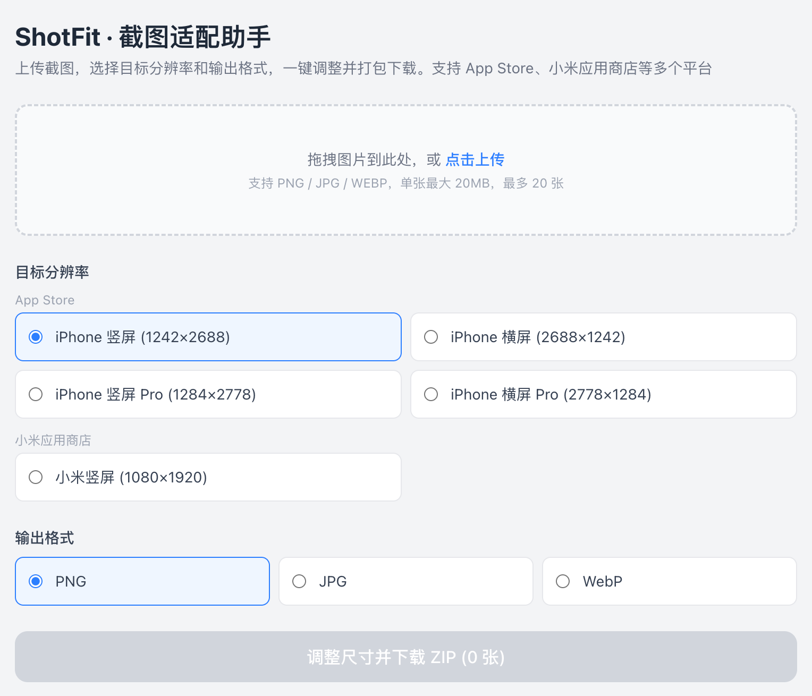

# App Store 截图尺寸调整工具

批量将截图调整为苹果应用商店所需的固定分辨率，无需上传服务器，所有处理均在浏览器本地完成。


## 在线体验

**[https://scrennshot-resizer.vercel.app](https://scrennshot-resizer.vercel.app)**

免费部署在 Vercel，无需安装，打开即用。

## 界面预览



## 功能特点

- **拖拽或点击上传** — 支持 PNG、JPG、WEBP 格式
- **批量处理** — 最多同时上传 20 张图片
- **4 种 App Store 分辨率** — 覆盖主流 iPhone 机型
- **强制拉伸调整** — 基于 Canvas API，输出尺寸精确匹配
- **一键打包下载** — 所有调整后的图片打包为一个 ZIP 文件
- **文件名去重** — 自动处理同名文件冲突
- **数据不离开设备** — 全程本地处理，无任何上传

## 支持的分辨率

| 设备 | 分辨率 |
|------|--------|
| iPhone 竖屏 | 1242 × 2688 px |
| iPhone 横屏 | 2688 × 1242 px |
| iPhone 竖屏 Pro | 1284 × 2778 px |
| iPhone 横屏 Pro | 2778 × 1284 px |

## 本地开发

### 环境要求

- Node.js 18+
- npm

### 启动开发服务器

```bash
# 克隆仓库
git clone https://github.com/yuhuotech/screenshot-resizer.git
cd screenshot-resizer

# 安装依赖
npm install

# 启动开发服务器
npm run dev
```

打开 [http://localhost:3000](http://localhost:3000) 即可使用。

### 构建

```bash
npm run build
npm start
```

### 运行测试

```bash
npm test
```

## 部署到 Vercel

**方式一 — Vercel CLI：**

```bash
npm run deploy
```

首次运行会提示登录并配置项目，之后每次直接部署到生产环境。

**方式二 — 连接 GitHub 仓库：**

1. 将代码推送到 GitHub
2. 访问 [vercel.com](https://vercel.com) → New Project → 导入仓库
3. Vercel 自动识别 Next.js，点击 Deploy 即可

无需 `vercel.json`，Vercel 对 Next.js 项目全自动配置。

## 技术栈

| 层级 | 技术 |
|------|------|
| 框架 | [Next.js 16](https://nextjs.org)（App Router） |
| 语言 | TypeScript 5 |
| 样式 | [Tailwind CSS v4](https://tailwindcss.com) |
| 图片处理 | 浏览器 Canvas API |
| ZIP 打包 | [JSZip](https://stuk.github.io/jszip/) |
| 文件下载 | [FileSaver.js](https://github.com/eligrey/FileSaver.js/) |
| 测试 | Jest + jest-canvas-mock |

## 工作原理

1. 用户上传图片 → 客户端校验格式、大小、数量
2. 通过 `URL.createObjectURL()` 生成本地预览
3. 点击处理：每张图片绘制到目标尺寸的 `<canvas>`，使用 `drawImage()` 强制拉伸
4. `toBlob()` 导出为 Blob，立即释放 object URL 节省内存
5. 所有 Blob 打包为 JSZip 压缩包，通过 FileSaver 触发下载

## 项目结构

```
├── app/
│   ├── layout.tsx              # 根布局
│   └── page.tsx                # 主页面 + 状态管理
├── components/
│   ├── UploadZone.tsx          # 拖拽上传区域
│   ├── ImageList.tsx           # 缩略图列表
│   └── ResolutionSelector.tsx  # 分辨率选择器
├── lib/
│   ├── types.ts                # 共享类型 + 分辨率常量
│   ├── resizeImage.ts          # Canvas 缩放逻辑
│   └── buildZip.ts             # ZIP 打包 + 文件名去重
└── __tests__/
    └── lib/
        ├── resizeImage.test.ts
        └── buildZip.test.ts
```

## 参与贡献

欢迎提交 Pull Request。如有较大改动，请先开 Issue 讨论。

1. Fork 本仓库
2. 新建分支：`git checkout -b feat/your-feature`
3. 提交改动：`git commit -m "feat: 添加新功能"`
4. 推送分支：`git push origin feat/your-feature`
5. 发起 Pull Request

## 许可证

[MIT](LICENSE)
